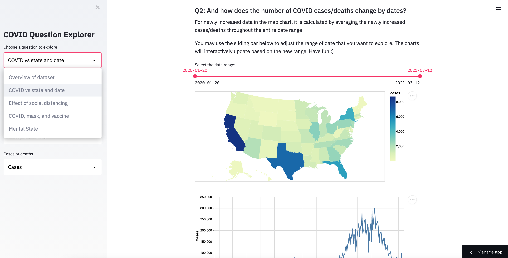

# Project name

TODO: Update screenshot

TODO: Short abstract describing the main goals and how you achieved them.

## Project Goals

The COVID-19 pandemic is an unprecedented event that has influenced billions of people around the world. Since the first quarter of 2020, people’s life has been changed dramatically. Most of the things that require people to gather, such as going to work and school, become remote to ensure people’s safety and prevent COVID from further spreading. In this project, we build an interactive data visualization and analysis web application based on mainly the COVID dataset from [New York Times](https://github.com/nytimes/covid-19-data) and the [Delphi COVID Survey Results](https://delphi.cmu.edu/covidcast/survey-results/) from CMU, focusing specifically COVID data within the United States. With the interactive application we built, we hope it can help people learn more about the overall COVID situation and how exactly COVID has affected people’s life. Some of the questions we explicitly listed for users to explore include:

How does the number of COVID cases/deaths vary by states?
How does the number of COVID cases/deaths change by dates?
How does social distancing affect the number of COVID cases?
Alternatively, how does the number of COVID cases affect social distancing practices?
Does people feel anxious, depressed or isolated during covid periods? Are people's feelings different by the number of cases in their states?

Apart from these explicit questions, the users are also free to explore other questions as needed in our application. We hope this can be helpful in letting people know more about COVID.

## Design

We utilize various kinds of visualization techniques to present the data in multiple dimensions. The interactivity involved in some of these charts can help users explore different data more easily and intuitively.

Chart 1: choropleth map of United States. Nothing is better than using a map to show the severity of COVID in each state in the United States. With deeper color emphasizing the higher severity of COVID, users can know the states that are most influenced by COVID at the very first glance. Additionally, we provide an interactive sliding bar to allow users to specify the range of data that they want to investigate. By dragging the right slider from left to right, users can know how the COVID situation evolves from time to time. In addition, we provide two dropdown menus in the sidebar. The first dropdown menu allows users to toggle between showing newly increased number and cumulative number, and the second one allows switching between displaying the number of positive cases and deaths. Right after toggling, the map and below line chart will interactively change to show corresponding data.

Chart 2: line chart of COVID cases or deaths. To show how COVID cases evolve over time, using a line chart is a good choice. The sliding bar and two dropdown menus I described above also apply to this chart, so users can freely zoom in and out of a particular date range and change between different types of data.

Chart 3: Stacked area chart + scatter chart of social distancing factors. We have debated on the type of chart to present this data. Some options include grouped bar chart, stacked bar chart, and line chart. We ended up using a combination of stacked area chart and scatter chart because we want to show both the overall trend of social distancing practice and the individual trend of each factor. Stacked bar chart can be a good option for the first goal, but since we have a lot of dates, stacked bar chart becomes too dense (which essentially approximate the stacked area chart). For the second goal, a line chart would also be great. However, again the datapoints are a bit dense, a scatter point chart would be aesthetically better. Users can toggle between stacked area chart and scatter chart on the sidebar. The interactivity here is that users can freely select the social distancing factors they want to include and evaluate on the siderbar. By default, the chart takes all factors into account.

Chart 4: line chart of COVID cases in the same date range of chart 3. This chart is mainly used to investigate the relationship between social distancing factors and COVID cases. There’s an interaction that allows users to select a range of dates on chart 4, causing chart 3 to zoom into that range, so the users can take a closer look at how social distancing factors distribute.

Chart 5 & 6: Two scatter plots to see if there is any correlation between people’s acceptance to masks and vaccines, and the number of COVID cases increases. We characterize each state as a single point in the graph. The x axis shows how many people in the survey pool are likely to wear masks or take vaccines, and the y axis shows the number of COVID case increases in the state. This page includes an interaction that allows users to select the day for investigation. One conclusion that could be drawn from this interaction is that the point cluster of mask wearing is moving to the right as the time moves forward, meaning that more and more people start wearing masks. Users could see details about each point (which state does the point belong to?) through its tooltips.

Chart 7&8: Two bar plots to see to what extent people felt anxious, depressed or isolated. We found that more people feel isolated than depressed. To see if the number of cases in the state affect the number of people who feel anxious, we collect and plot the data for the states with the top 5 number of cases per 100K people and those with bottom 5 number of cases per 100K people. This page includes an interaction that allows users to select the day for investigation. We place the two plot along the vertical axis so that users could do a direct comparison for the two plots. 

## Development

Both of us contribute to the development of this project equally. Firstly, we scheduled a Zoom meeting to decide the dataset that we want to explore and possible questions that we can explore. This took each of us around 3 people-hours.

After that, we scheduled another meeting to divide the tasks in half. Jiajun plotted the first version of the COVID map in the United States with slider bar interactivity, the charts involving wearing masks and accepting vaccines, and the bar plots showing how many people feel anxious, depressed or isolated. Jiajun spent 15 hours. Zixu updated the COVID map chart with the NYT data, extended the chart with the line chart (chart 2), and added dropdown menu interactivity to both of them. Additionally, Zixu developed chart 3 and 4 that involves social distancing factors. In the development stage, Zixu spent around 15 people-hours in total, with most of the time trying to figure out the right type of chart and how to properly implement interactive charts in Streamlit and Altair.

Regarding the write-up, each of us writes on the charts that we develop. This took us each 2.5 people-hours.

## Success Story

Our application provides a tool for people to track the spread of covid. Through our visualization, people could draw a few insights on the effect of social distancing, mask wearing and vaccine taking. For example, we can see that there's an approximately inverse relationship between COVID cases and amount of non-social-distancing activities. When there were more COVID cases (e.g. at the end of December), people had better social distancing practice. However, when there were less COVID cases in February, people started to go outside. Another insight is that there is a weak anti-correlation between the acceptance of vacancies and the number of COVID case increases: as more people accept vaccines, the number of COVID cases increases slower. We acknowledge that our conclusion may be affected by our confirmation bias, and that some conclusions might change if we have survey data dating back to the start of COVID. Nevertheless, we found data visualization to be a very powerful and effective tool for identifying patterns and mine insights.

